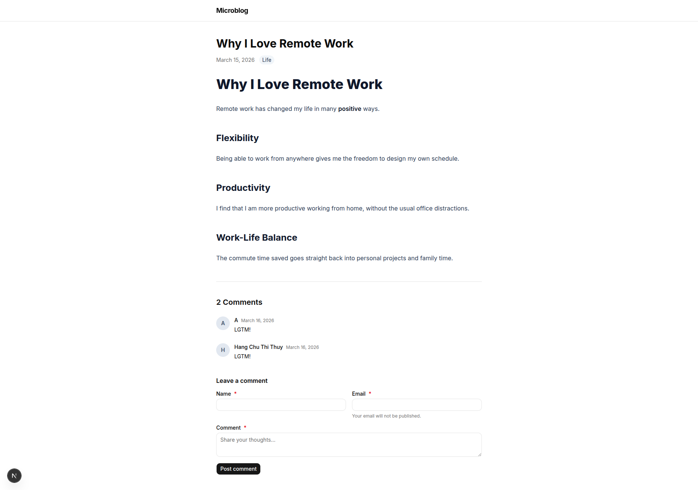
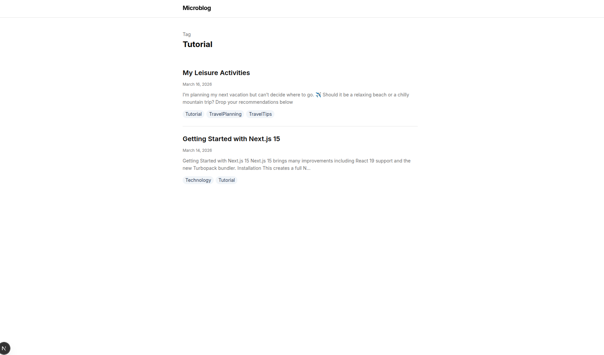
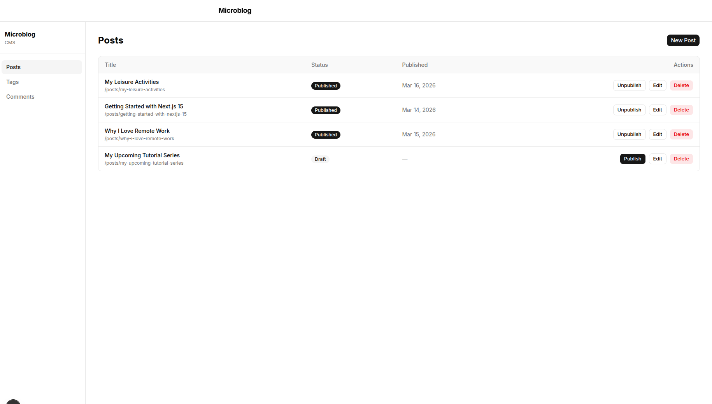
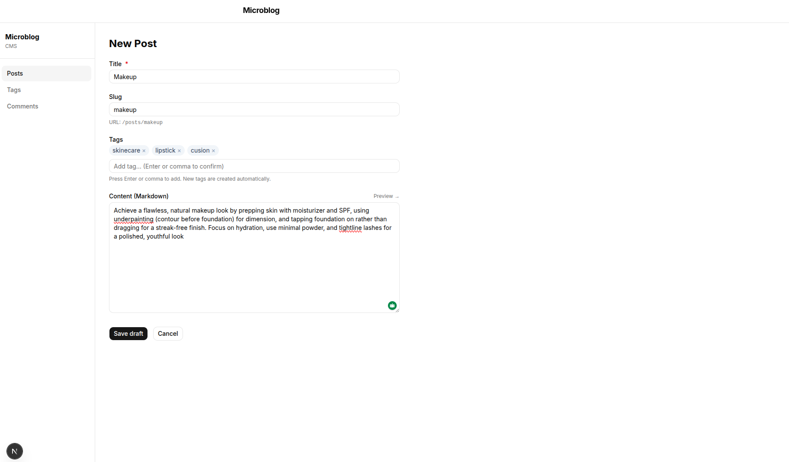
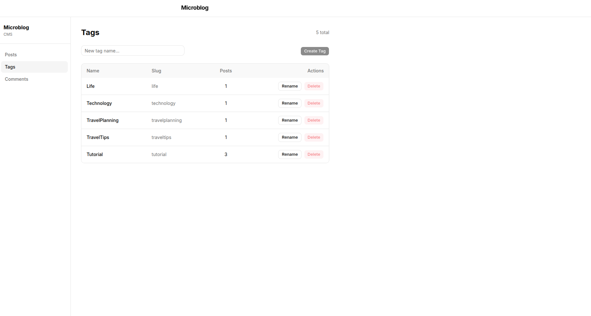

# Microblog Web App

---

## 🌟 Giới Thiệu Sản Phẩm

**Microblog** là nền tảng blog cá nhân hiện đại — nơi bạn viết ý tưởng, chia sẻ kiến thức và kết nối với độc giả chỉ trong vài phút. Giao diện tối giản, tốc độ nhanh, dễ sử dụng cho cả người đọc lẫn người quản trị.

---

### 📱 Màn Hình Sản Phẩm

#### Trang chủ — Danh sách bài viết

> Hiển thị toàn bộ bài viết đã xuất bản, sắp xếp theo thời gian mới nhất. Mỗi bài viết có tiêu đề, trích dẫn nội dung, danh sách thẻ tag và ngày đăng.

🔗 **Demo:** https://project-0e66m-79lo03ksi-chuhangpt96-8349s-projects.vercel.app/


<!-- 📸 Chèn ảnh chụp màn hình trang chủ vào đây -->

---

#### Chi Tiết Bài Viết

> Đọc toàn bộ nội dung bài viết được render từ Markdown. Phía cuối trang hiển thị phần bình luận từ độc giả đã được phê duyệt.

🔗 **Demo:** https://project-0e66m-79lo03ksi-chuhangpt96-8349s-projects.vercel.app/posts/why-i-love-remote-work


<!-- 📸 Chèn ảnh chụp màn hình trang bài viết vào đây -->

---

#### Trang Tag — Lọc Bài Viết Theo Chủ Đề

> Click vào một thẻ tag để xem tất cả bài viết thuộc chủ đề đó.

🔗 **Demo:** https://project-0e66m-79lo03ksi-chuhangpt96-8349s-projects.vercel.app/tags/productivity


<!-- 📸 Chèn ảnh chụp màn hình trang tag vào đây -->

---

#### Bình Luận — Gửi Phản Hồi Bài Viết

> Độc giả có thể gửi bình luận ngay dưới bài viết mà không cần tạo tài khoản. Bình luận sẽ được kiểm duyệt trước khi hiển thị công khai.

🔗 **Demo:** https://project-0e66m-79lo03ksi-chuhangpt96-8349s-projects.vercel.app/posts/why-i-love-remote-work#comments


<!-- 📸 Chèn ảnh chụp màn hình form bình luận vào đây -->

---

#### Admin — Đăng Nhập CMS

> Người quản trị đăng nhập bằng email và mật khẩu. Phiên đăng nhập được bảo vệ bởi cookie bảo mật.

🔗 **Demo:** https://project-0e66m-79lo03ksi-chuhangpt96-8349s-projects.vercel.app/admin/login


<!-- 📸 Chèn ảnh chụp màn hình trang login vào đây -->

---

#### Admin — Quản Lý Bài Viết

> Danh sách tất cả bài viết với trạng thái (Đã xuất bản / Nháp). Admin có thể tạo mới, chỉnh sửa hoặc xóa bài viết trực tiếp từ đây.

🔗 **Demo:** https://project-0e66m-79lo03ksi-chuhangpt96-8349s-projects.vercel.app/admin/posts


<!-- 📸 Chèn ảnh chụp màn hình trang admin posts vào đây -->

---

#### Admin — Soạn Thảo Bài Viết

> Trình soạn thảo Markdown đầy đủ tính năng: tiêu đề, slug tự động, nội dung Markdown, gán tag, lưu nháp hoặc xuất bản ngay lập tức.

🔗 **Demo:** https://project-0e66m-79lo03ksi-chuhangpt96-8349s-projects.vercel.app/admin/posts/new


<!-- 📸 Chèn ảnh chụp màn hình trang soạn thảo vào đây -->

---

#### Admin — Kiểm Duyệt Bình Luận

> Danh sách tất cả bình luận đang chờ phê duyệt. Admin có thể duyệt hoặc từ chối từng bình luận chỉ với một click.

🔗 **Demo:** https://project-0e66m-79lo03ksi-chuhangpt96-8349s-projects.vercel.app/admin/comments


<!-- 📸 Chèn ảnh chụp màn hình trang kiểm duyệt vào đây -->

---

#### Admin — Quản Lý Tag

> Tạo mới, đổi tên hoặc xóa tag. Tag đang được sử dụng bởi bài viết sẽ không thể xóa, đảm bảo dữ liệu toàn vẹn.

🔗 **Demo:** https://project-0e66m-79lo03ksi-chuhangpt96-8349s-projects.vercel.app/admin/tags


<!-- 📸 Chèn ảnh chụp màn hình trang quản lý tag vào đây -->

---

### 👤 Trải Nghiệm Người Dùng (Độc Giả)

Microblog mang đến trải nghiệm đọc blog mượt mà, không quảng cáo, không rắc rối:

| Tính năng | Mô tả |
|-----------|-------|
| 📰 **Đọc bài viết** | Toàn bộ nội dung được hiển thị đẹp mắt, hỗ trợ Markdown với heading, code block, hình ảnh |
| 🏷️ **Khám phá theo chủ đề** | Click vào tag để lọc ngay bài viết cùng chủ đề |
| 💬 **Gửi bình luận** | Để lại phản hồi không cần đăng ký tài khoản, chỉ cần nhập tên và email |
| ⚡ **Tốc độ cao** | Trang được render phía server, tải cực nhanh ngay cả trên mạng chậm |
| 📱 **Responsive** | Hiển thị tốt trên mọi thiết bị: điện thoại, máy tính bảng, laptop |

**Hành trình của một độc giả điển hình:**

```
Vào trang chủ
  → Lướt danh sách bài viết mới nhất
  → Click vào bài viết yêu thích
  → Đọc nội dung chi tiết
  → Click tag để khám phá bài viết liên quan
  → Gửi bình luận / phản hồi
```

---

### 🛠️ Trải Nghiệm Quản Trị Viên (Admin)

Microblog CMS cho phép quản trị viên kiểm soát toàn bộ nội dung từ một giao diện duy nhất, đơn giản và trực quan:

#### ✍️ Tạo & Quản Lý Bài Viết

1. **Đăng nhập** tại `/admin/login` bằng email và mật khẩu
2. Vào **Danh sách bài viết** — xem toàn bộ bài viết với trạng thái hiện tại
3. Click **"New Post"** → mở trình soạn thảo:
   - Nhập tiêu đề → slug URL tự động được tạo
   - Viết nội dung bằng **Markdown** (hỗ trợ heading, in đậm, code, hình ảnh, link...)
   - Gán một hoặc nhiều **tag** cho bài viết
   - Chọn **"Save Draft"** để lưu nháp chưa công khai
   - Chọn **"Publish"** để xuất bản ngay lập tức
4. Muốn chỉnh sửa → click nút **Edit** bên cạnh bài viết bất kỳ
5. Muốn gỡ xuống → click **Unpublish** → bài viết trở về trạng thái nháp

#### 🔖 Quản Lý Tag

1. Vào mục **Tags** trên thanh sidebar
2. Nhập tên tag mới → click **"Add Tag"**
3. Đổi tên hoặc xóa tag không còn sử dụng
4. Tag đang gán cho bài viết sẽ bị khóa xóa cho đến khi gỡ khỏi tất cả bài viết

#### 💬 Kiểm Duyệt Bình Luận

1. Vào mục **Comments** trên thanh sidebar
2. Xem danh sách bình luận đang **chờ duyệt**
3. Click **"Approve"** → bình luận hiển thị công khai dưới bài viết
4. Click **"Reject"** → bình luận bị ẩn vĩnh viễn, không hiển thị cho độc giả

**Quy trình làm việc của Admin:**

```
Đăng nhập /admin/login
  → Soạn bài mới hoặc chỉnh sửa bài cũ
  → Lưu nháp hoặc xuất bản
  → Kiểm duyệt bình luận mới từ độc giả
  → Quản lý danh sách tag
  → Đăng xuất
```

---

A minimal, fast, full-stack microblog — write in Markdown, publish instantly, moderate comments, manage tags — all from a built-in CMS.

## Tech Stack

| Layer | Technology |
|-------|-----------|
| Framework | [Next.js 15](https://nextjs.org) (App Router, Turbopack) |
| Language | TypeScript 5 |
| Styling | Tailwind CSS 3 + shadcn/ui |
| Database | [Supabase](https://supabase.com) (PostgreSQL 15 + RLS) |
| Auth | Supabase Auth (email/password, cookie session) |
| Deployment | [Vercel](https://vercel.com) (ISR + Edge CDN) |
| Testing | Vitest (unit) + Playwright (E2E) |
| Package Manager | pnpm |

---

## Features

### 📖 Public — Reader

- **Home timeline** (`/`) — all published posts, newest first, with tags and excerpt
- **Post detail** (`/posts/[slug]`) — full Markdown rendered to sanitized HTML
- **Tag pages** (`/tags/[slug]`) — filter posts by tag
- **Comment form** — submit comments without account (pending moderation)

### ✍️ Admin CMS (`/admin`)

- **Login** — secure email/password auth, session cookie managed by middleware
- **Create & publish posts** — Markdown editor with live preview, auto-slug generation
- **Edit posts** — update title, content, slug, tags at any time
- **Unpublish / soft-delete** — posts disappear from public immediately, data kept in DB
- **Comment moderation** — approve or reject pending comments
- **Tag management** — create, rename, delete tags (safe-delete: blocked if posts exist)

---

## Architecture

```
Browser
  └── Next.js 15 App Router (Vercel)
        ├── Public RSC Pages  (/  /posts/[slug]  /tags/[slug])
        ├── Admin CMS Pages   (/admin/*)  ← guarded by middleware
        └── API Route Handlers
              ├── POST /api/comments          ← public
              └── /api/admin/*                ← auth-required
                    ├── posts / [id]
                    ├── tags  / [id]
                    └── comments / [id]
  └── Supabase (PostgreSQL + Row Level Security)
        ├── posts, profiles, tags, post_tags, comments
        └── Auth (email/password, auto-create profile trigger)
```

---

## Data Model

```
profiles       posts               tags
───────────    ────────────────    ──────────
id (UUID)      id (UUID)           id (UUID)
name           title               name
email          slug (unique)       slug (unique)
role           body_markdown       created_at
               status              
               author_id ──► profiles.id
               published_at        post_tags
               deleted_at          ─────────
               created_at          post_id ─► posts.id
                                   tag_id  ─► tags.id

               comments
               ────────────────
               id (UUID)
               post_id ─► posts.id
               author_name
               author_email
               body
               status: pending | approved | rejected
```

---

## Getting Started (Local Development)

### Prerequisites

- Node.js 20 LTS
- pnpm (`npm i -g pnpm`)
- Docker (for Supabase local)
- Supabase CLI

### Setup

```bash
# 1. Install dependencies
pnpm install

# 2. Configure environment
cp .env.local.example .env.local
# Fill in NEXT_PUBLIC_SUPABASE_URL, NEXT_PUBLIC_SUPABASE_ANON_KEY, SUPABASE_SERVICE_ROLE_KEY

# 3. Start local Supabase (PostgreSQL + Auth + Studio)
supabase start

# 4. Apply migrations + seed data
supabase db push

# 5. Generate TypeScript types from DB schema
supabase gen types typescript --local > src/types/database.types.ts

# 6. Start dev server
pnpm dev
```

Open [http://localhost:3000](http://localhost:3000)

| URL | Description |
|-----|-------------|
| http://localhost:3000 | Public site |
| http://localhost:3000/admin | CMS (redirects to login) |
| http://127.0.0.1:54323 | Supabase Studio (local DB) |

### Default Seed Credentials

| Field | Value |
|-------|-------|
| Email | `admin@example.com` |
| Password | `password123` |

---

## Environment Variables

```bash
# .env.local
NEXT_PUBLIC_SUPABASE_URL=https://<project-ref>.supabase.co
NEXT_PUBLIC_SUPABASE_ANON_KEY=eyJ...   # anon / public key
SUPABASE_SERVICE_ROLE_KEY=eyJ...       # secret — never expose to browser
```

Get these from: **Supabase Dashboard → Settings → API**

---

## Project Structure

```
src/
├── app/
│   ├── page.tsx                    ← Home timeline (RSC)
│   ├── posts/[slug]/page.tsx       ← Post detail + comments
│   ├── tags/[slug]/page.tsx        ← Tag timeline
│   ├── admin/                      ← CMS (auth-guarded)
│   │   ├── login/
│   │   ├── posts/  new/  [id]/edit/
│   │   ├── tags/
│   │   └── comments/
│   └── api/
│       ├── comments/route.ts       ← Public comment submit
│       └── admin/                  ← Admin REST API
├── components/
│   ├── ui/                         ← shadcn/ui primitives
│   ├── post/PostCard  PostBody
│   ├── tag/TagBadge
│   ├── comment/CommentForm  CommentList
│   └── admin/PostEditor  CommentModerationRow
├── lib/
│   ├── supabase/client.ts  server.ts
│   ├── queries/posts.ts  tags.ts  comments.ts
│   ├── utils/slug.ts  markdown.ts
│   └── validations/post.ts  tag.ts  comment.ts
└── middleware.ts                   ← Auth guard /admin/*
```

---

## Testing

```bash
# Unit tests (slug, markdown, validation)
pnpm vitest run

# Watch mode
pnpm vitest

# E2E tests (requires pnpm dev running)
pnpm exec playwright test

# TypeScript check
pnpm tsc --noEmit
```

---

## Deployment (Vercel)

1. Push code to GitHub
2. Import repo on [vercel.com](https://vercel.com) → Framework: **Next.js**
3. Add environment variables (from Supabase Dashboard → Settings → API):
   - `NEXT_PUBLIC_SUPABASE_URL`
   - `NEXT_PUBLIC_SUPABASE_ANON_KEY`
   - `SUPABASE_SERVICE_ROLE_KEY`
4. Push Supabase migrations to production:
   ```bash
   supabase link --project-ref <your-project-ref>
   supabase db push
   ```
5. Deploy ✅
https://project-0e66m-79lo03ksi-chuhangpt96-8349s-projects.vercel.app
---

## Post Lifecycle

```
draft ──[Publish]──► published ──[Unpublish]──► draft
                          │
                     [Soft-delete]
                          │
                    deleted_at = now()
              (hidden from public, kept in DB)
```

## Comment Moderation Flow

```
Reader submits comment
  → status: "pending"   (not visible publicly)
  → Admin reviews in /admin/comments
  → Approve → status: "approved" → visible on post
  → Reject  → status: "rejected" → permanently hidden
```

---

## License

MIT

## Deploy on Vercel

The easiest way to deploy your Next.js app is to use the [Vercel Platform](https://vercel.com/new?utm_medium=default-template&filter=next.js&utm_source=create-next-app&utm_campaign=create-next-app-readme) from the creators of Next.js.

Check out our [Next.js deployment documentation](https://nextjs.org/docs/app/building-your-application/deploying) for more details.
